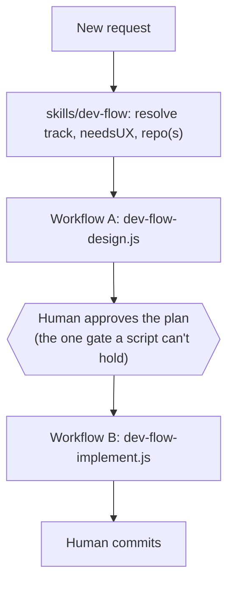
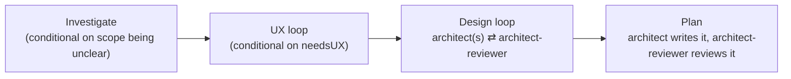
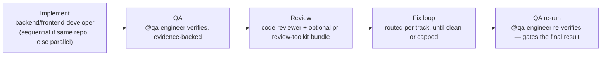

`/dev-flow` automates the design-gate and review-gate rounds of the [engineering
loop](../concepts/#deterministic-orchestration-dev-flow) as real control flow —
not the model remembering to keep looping correctly on its own. This page is the
mechanics: why it's built as a skill *plus* two `Workflow` scripts rather than
either alone, what each phase actually does, and how the loops know when to stop.

## Why a hybrid, not one or the other

A skill alone can't guarantee it keeps looping correctly — that depends on the
model remembering to. The `Workflow` tool alone can't pause mid-run to ask you
anything — a script runs start to finish autonomously, and this repo's own hard
rule is that non-trivial work needs your explicit plan approval before
implementation starts. So the design splits along that exact seam:

- **`skills/dev-flow/SKILL.md`** (thin) — resolves the request, holds the one
  human approval gate, and is the only place that talks to you.
- **`workflows/dev-flow-design.js`** and **`workflows/dev-flow-implement.js`** —
  real JavaScript, run by the `Workflow` tool, no human interaction inside them.

## Workflow A — investigate, design, plan

- **Investigate** — only runs if the request's scope is genuinely unclear;
  `@feature-investigator` scopes it into an unambiguous requirement first.
- **UX** — only runs if the work needs a fresh UX pass (new flow, new screen) —
  `@ux-designer` ⇄ `@figma-designer` ⇄ fidelity-check, looping until approved.
- **Design** — one architect per track (`@backend-architect` and/or
  `@frontend-architect`, run in parallel when the work spans both) ⇄
  `@architect-reviewer`, looping until approved. Each round's feedback is fed
  into the next round's prompt — a retry is a refinement, not a blind re-roll.
- **Plan** — the architect writes the implementation plan; `@architect-reviewer`
  reviews it once more. `Workflow A` returns the plan plus whether the design
  loop actually converged — if it capped out instead, the skill says so plainly
  when it shows you the plan, rather than presenting a capped-out draft the same
  way it'd present an approved one.

## The human gate

`Workflow A` runs to completion and returns; the skill shows you the plan and
waits for an ordinary conversational approval — this is not a pause *inside* a
`Workflow` run, since there's no such thing. `Workflow B` is a separate call,
made only after you approve. The state that survives between them is just the
plan file already written to `docs/work/<slug>/plans/plan.md` — approving days
later, even in a new session, is "read that file, call `Workflow B`." No special
resume mechanism, no extra persistence layer.

## Workflow B — implement, verify, review, re-verify

- **Implement** — `@backend-developer` and/or `@frontend-developer` build the
  approved plan. Two tracks in the *same* repo run sequentially, never in
  parallel, to avoid concurrent writes to one branch; genuinely separate repos
  run in parallel since there's no shared-branch conflict.
- **QA** — `@qa-engineer` verifies the implementation and writes an
  evidence-backed report (a real exit code, screenshot, or log — never a bare
  "looks good").
- **Review** — `@code-reviewer` (always present) plus, when installed, the
  `pr-review-toolkit` bundle (`pr-test-analyzer`, `silent-failure-hunter`,
  `type-design-analyzer`, `comment-analyzer`). A missing optional plugin
  degrades gracefully; a genuine failure of the required reviewer is logged,
  never silently treated as "clean."
- **Fix loop** — findings route to the track they're tagged for; developers fix,
  reviewers re-check.
- **QA re-run** — `@qa-engineer` re-verifies after the fix loop, and this is
  what actually gates the final pass/fail — not the pre-fix QA pass. It runs
  even if the fix loop never reached clean, so the report reflects real final
  state either way, not an assumption.

You still run `git commit` yourself — `dev-flow` never commits.

## How the loops know when to stop

Every loop needs more than "keep trying until approved," because a bare retry
count can't tell genuine slow progress from a stuck loop. Each one combines four
signals:

| Signal | What it catches |
|---|---|
| **Convergence** | The actual success condition — approved, or zero findings |
| **Hard round cap** | A backstop so nothing runs forever |
| **Token-budget guard** | Stops early if the run is burning an unusual amount |
| **Non-progress circuit breaker** | Aborts immediately if a round's findings exactly match the previous round's — a stuck loop, not a converging one |

The two caps are deliberately different, not copy-pasted: the design-gate loop
caps at **3 rounds**, the review-gate fix loop at **2**. At a cap of 2, the
circuit breaker can only ever compare on the very last allowed round, which
makes it unable to save any work — 3 is the minimum depth where "stop early"
and "hit the cap anyway" are actually different outcomes. The review loop's
breaker earns its keep at 2, so it stays there.

## Track, UX, and repo resolution

- **`track`** is exactly `backend`, `frontend`, or `both` — inferred from the
  request, asked via a clarifying question only when genuinely ambiguous.
- **`needsUX`** is a separate flag from track — true only for work that needs a
  fresh UX pass, not implied by "this touches the frontend."
- **`repo`** defaults to the directory you're already in, same as `/code-review`
  or `/save-plan` — no need to specify it for the common case. A second repo is
  only asked for when `track: both` spans two genuinely separate codebases and a
  quick check of the working directory can't already tell.

## If the `Workflow` tool isn't available

The skill checks whether `Workflow` is actually callable before using it, rather
than assuming from configuration. If it isn't, `skills/dev-flow/SKILL.md`
documents a full manual fallback: the identical phase order and loop logic,
driven by direct sequential `@agent` calls instead of a script. Slower, same
gates, same outcome.

## Source

`skills/dev-flow/SKILL.md`, `workflows/dev-flow-design.js`,
`workflows/dev-flow-implement.js` — plugin root, not nested under the skill.

## Next

- [Subagents](../subagents/) — what `@qa-engineer` and the architects/developers
  `dev-flow` drives actually do.
- [Use cases](../use-cases/) — where this fits in the full build walkthrough.
